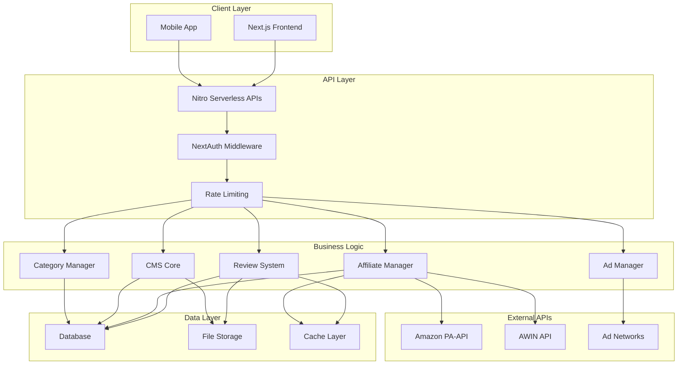

# Design Document: Shopping Review Platform

## Overview

The Shopping Review Platform is a comprehensive e-commerce review website built with Next.js 14, TypeScript, and Nitro for serverless deployment. The platform provides product reviews across multiple categories, integrates with affiliate networks (Amazon, AWIN, Best Buy, Walmart), and monetizes through strategic advertisement placement.

The architecture follows a security-first approach with Zero Trust principles, implementing NextAuth for authentication, comprehensive input validation, and protection against common vulnerabilities (XSS, CSRF, SQL injection).

## Architecture

### High-Level Architecture



### Security Architecture

The platform implements a multi-layered security approach:

1. **Input Validation Layer**: All user inputs validated and sanitized at API boundaries
2. **Authentication Layer**: NextAuth with secure session management
3. **Authorization Layer**: Role-based access control (RBAC)
4. **Rate Limiting**: Protection against DDoS and abuse
5. **Data Protection**: Encryption at rest and in transit

## Components and Interfaces

### 1. Review System

**Purpose**: Manages product reviews, ratings, and content creation.

**Key Interfaces**:
```typescript
interface Review {
  id: string;
  title: string;
  excerpt: string;
  content: string;
  featuredImage: string;
  author: Author;
  category: Category[];
  products: Product[];
  publishedAt: Date;
  status: 'draft' | 'review' | 'published';
  seoMetadata: SEOMetadata;
}

interface Product {
  id: string;
  name: string;
  description: string;
  image: string;
  price: Price;
  affiliateLinks: AffiliateLink[];
  category: string;
}

interface AffiliateLink {
  retailer: 'amazon' | 'bestbuy' | 'walmart' | 'awin';
  url: string;
  trackingCode: string;
  price: number;
  currency: string;
}
```

**Security Considerations**:
- Content sanitization using DOMPurify
- XSS prevention through proper escaping
- CSRF protection on all mutations

### 2. Affiliate Manager

**Purpose**: Manages affiliate partnerships, link generation, and revenue tracking.

**Key Interfaces**:
```typescript
interface AffiliateManager {
  generateAmazonLink(productId: string, associateTag: string): Promise<string>;
  generateAWINLink(productId: string, publisherId: string): Promise<string>;
  trackClick(linkId: string, userId?: string): Promise<void>;
  getPerformanceMetrics(dateRange: DateRange): Promise<Metrics>;
  bulkImportProducts(source: 'amazon' | 'awin', data: any[]): Promise<void>;
}

interface AmazonPAAPI {
  searchProducts(query: string): Promise<AmazonProduct[]>;
  getProductDetails(asin: string): Promise<AmazonProduct>;
  getBrowseNodeInfo(browseNodeId: string): Promise<BrowseNode>;
}

interface AWINAPI {
  getProducts(advertiserId: string): Promise<AWINProduct[]>;
  createDeepLink(url: string): Promise<string>;
  getTransactions(dateRange: DateRange): Promise<Transaction[]>;
}
```

**Integration Patterns**:
- Amazon PA-API: RESTful API with AWS signature authentication
- AWIN API: OAuth 2.0 authentication with rate limiting
- Caching strategy for product data (24-hour TTL)
- Fallback mechanisms for API failures

### 3. Custom CMS

**Purpose**: Content management system for reviews, products, and bulk operations.

**Key Interfaces**:
```typescript
interface CMS {
  createReview(review: CreateReviewInput): Promise<Review>;
  updateReview(id: string, updates: UpdateReviewInput): Promise<Review>;
  bulkImportProducts(data: BulkProductData): Promise<ImportResult>;
  uploadImage(file: File): Promise<ImageUploadResult>;
  generateSEOMetadata(content: string): Promise<SEOMetadata>;
}

interface BulkProductData {
  source: 'json' | 'amazon-api' | 'awin-api';
  data: any[];
  mapping: FieldMapping;
}

interface ImageUploadResult {
  url: string;
  optimizedUrls: {
    thumbnail: string;
    medium: string;
    large: string;
  };
  altText: string;
  seoFilename: string;
}
```

**Features**:
- Rich text editor with markdown support
- Image optimization and CDN integration
- Version control with rollback capabilities
- Bulk operations with progress tracking
- SEO optimization tools

### 4. Authentication System

**Purpose**: Secure user authentication and authorization using NextAuth.

**Configuration**:
```typescript
interface AuthConfig {
  providers: [
    GoogleProvider,
    GitHubProvider,
    EmailProvider
  ];
  session: {
    strategy: 'jwt';
    maxAge: 30 * 24 * 60 * 60; // 30 days
  };
  cookies: {
    sessionToken: {
      name: 'next-auth.session-token';
      options: {
        httpOnly: true;
        sameSite: 'lax';
        path: '/';
        secure: true;
      };
    };
  };
}

interface UserRole {
  id: string;
  name: 'admin' | 'editor' | 'viewer';
  permissions: Permission[];
}
```

**Security Features**:
- HTTP-only secure cookies
- CSRF protection
- Session rotation
- Role-based access control

## Data Models

### Database Schema

```typescript
// Reviews Table
interface ReviewEntity {
  id: string;
  title: string;
  slug: string;
  excerpt: string;
  content: string; // Rich text/markdown
  featuredImageUrl: string;
  authorId: string;
  status: 'draft' | 'review' | 'published';
  publishedAt: Date | null;
  createdAt: Date;
  updatedAt: Date;
  seoTitle: string;
  seoDescription: string;
  seoKeywords: string[];
}

// Products Table
interface ProductEntity {
  id: string;
  name: string;
  description: string;
  imageUrl: string;
  categoryId: string;
  brand: string;
  model: string;
  createdAt: Date;
  updatedAt: Date;
}

// Affiliate Links Table
interface AffiliateLinkEntity {
  id: string;
  productId: string;
  retailer: string;
  originalUrl: string;
  affiliateUrl: string;
  price: number;
  currency: string;
  isActive: boolean;
  lastChecked: Date;
}

// Categories Table
interface CategoryEntity {
  id: string;
  name: string;
  slug: string;
  description: string;
  parentId: string | null;
  imageUrl: string;
  seoTitle: string;
  seoDescription: string;
}

// Users Table
interface UserEntity {
  id: string;
  email: string;
  name: string;
  image: string;
  role: 'admin' | 'editor' | 'viewer';
  createdAt: Date;
  lastLoginAt: Date;
}
```

### Relationships

- Reviews → Products (Many-to-Many)
- Reviews → Categories (Many-to-Many)
- Products → AffiliateLinks (One-to-Many)
- Categories → Categories (Self-referencing for hierarchy)
- Users → Reviews (One-to-Many as author)

## Correctness Properties

*A property is a characteristic or behavior that should hold true across all valid executions of a system-essentially, a formal statement about what the system should do. Properties serve as the bridge between human-readable specifications and machine-verifiable correctness guarantees.*

Before defining the correctness properties, I need to analyze the acceptance criteria from the requirements to determine which ones are testable as properties.

### Converting EARS to Properties

Based on the prework analysis, I'll convert the testable acceptance criteria into universally quantified properties, combining related properties to eliminate redundancy:

**Property 1: Review Data Integrity**
*For any* review creation with valid input data (title, excerpt, author, featured image, content), the system should successfully store all provided fields and retrieve them identically
**Validates: Requirements 1.1, 1.2**

**Property 2: Review Content Structure**
*For any* published review, the rendered output should contain all required sections (introduction, product overview, detailed product sections, conclusion) in the correct order
**Validates: Requirements 1.3**

**Property 3: Affiliate Link Generation**
*For any* supported retailer (Amazon, Best Buy, Walmart, AWIN) and valid product, the system should generate a properly formatted affiliate link with correct tracking codes
**Validates: Requirements 1.4, 3.4**

**Property 4: Price Display Formatting**
*For any* product with pricing information, the display should include both the price amount and retailer attribution in the format "$X at [Retailer]"
**Validates: Requirements 1.5**

**Property 5: Category Filtering**
*For any* category selection, browsing or searching within that category should return only reviews and products assigned to that category or its subcategories
**Validates: Requirements 2.2, 2.5**

**Property 6: Category Assignment**
*For any* review, it should be possible to assign it to multiple categories, and all category associations should be maintained and retrievable
**Validates: Requirements 2.3**

**Property 7: Category Hierarchy**
*For any* category with subcategories, the parent-child relationships should be maintained correctly, and operations on parent categories should appropriately include subcategory content
**Validates: Requirements 2.4**

**Property 8: API Integration Round Trip**
*For any* valid product identifier, fetching product data from external APIs (Amazon PA-API, AWIN API) and storing it should result in retrievable product information that matches the API response
**Validates: Requirements 3.2, 3.3, 5.5, 5.6**

**Property 9: Affiliate Click Tracking**
*For any* affiliate link click, the system should record the click event with proper tracking data and maintain the tracking information through the redirect process
**Validates: Requirements 3.5, 3.6**

**Property 10: Bulk Import Consistency**
*For any* valid JSON bulk import data, the number of successfully created products should equal the number of valid product records in the import, and each created product should contain all mapped fields from the import data
**Validates: Requirements 5.4**

**Property 11: Content Workflow States**
*For any* content item, it should be possible to transition between draft, review, and published states, and the current state should always be accurately reflected in queries and displays
**Validates: Requirements 5.3**

**Property 12: Version Control Round Trip**
*For any* content edit followed by a rollback operation, the content should be restored to its exact previous state
**Validates: Requirements 5.7**

**Property 13: Input Validation and Security**
*For any* user input containing potentially malicious content (XSS, SQL injection attempts), the system should sanitize the input and prevent the malicious content from being stored or executed
**Validates: Requirements 6.2, 8.2**

**Property 14: Role-Based Access Control**
*For any* user with a specific role (admin, editor, viewer), they should only be able to perform operations that are permitted for their role, and should be denied access to operations outside their permissions
**Validates: Requirements 6.4**

**Property 15: Rate Limiting**
*For any* API endpoint, when the request rate exceeds the configured limit, subsequent requests should be throttled or rejected with appropriate error responses
**Validates: Requirements 6.5**

**Property 16: Content Display Completeness**
*For any* review or product display, all required elements (title, excerpt, author, images, pricing, CTAs) should be present in the rendered output
**Validates: Requirements 7.1, 7.2, 7.3**

**Property 17: Responsive Design**
*For any* page content, when viewed on different screen sizes (mobile, tablet, desktop), the content should remain readable and properly formatted
**Validates: Requirements 7.5**

**Property 18: Search Result Relevance**
*For any* search query, the returned results should contain the search terms and be ranked with more recent and relevant content appearing first
**Validates: Requirements 9.1, 9.2**

**Property 19: Search Filtering**
*For any* search with applied filters (category, price range, rating), all returned results should match the filter criteria
**Validates: Requirements 9.3**

**Property 20: SEO Metadata Generation**
*For any* page or content item, the system should generate appropriate meta tags, structured data, and SEO-optimized URLs
**Validates: Requirements 10.3**

**Property 21: Performance Optimization**
*For any* page load, images should be optimized and lazy-loaded, and caching headers should be properly set for static resources
**Validates: Requirements 10.4, 10.5**

## Error Handling

### Error Categories and Responses

**1. Validation Errors**
- Invalid input data (missing required fields, malformed data)
- Response: 400 Bad Request with detailed field-level error messages
- Logging: Info level with sanitized input data

**2. Authentication/Authorization Errors**
- Unauthenticated requests to protected endpoints
- Insufficient permissions for requested operation
- Response: 401 Unauthorized or 403 Forbidden
- Logging: Warning level with user ID and attempted operation

**3. External API Errors**
- Amazon PA-API rate limiting or service unavailability
- AWIN API authentication failures
- Response: 503 Service Unavailable with retry-after header
- Fallback: Cached data when available
- Logging: Error level with API response details

**4. Database Errors**
- Connection failures
- Constraint violations
- Response: 500 Internal Server Error (generic message to user)
- Logging: Error level with full stack trace
- Monitoring: Alert on database connection issues

**5. File Upload Errors**
- File size exceeds limits
- Unsupported file formats
- Image processing failures
- Response: 400 Bad Request with specific error message
- Logging: Warning level with file metadata

### Error Recovery Strategies

**Circuit Breaker Pattern**: For external API calls (Amazon, AWIN)
- Open circuit after 5 consecutive failures
- Half-open state after 30-second timeout
- Fallback to cached data when circuit is open

**Graceful Degradation**: 
- Display cached product data when APIs are unavailable
- Show placeholder images when image processing fails
- Disable affiliate links when tracking service is down

**Retry Logic**:
- Exponential backoff for transient failures
- Maximum 3 retry attempts for API calls
- Immediate retry for network timeouts

## Testing Strategy

### Dual Testing Approach

The platform will implement both unit testing and property-based testing to ensure comprehensive coverage:

**Unit Tests**: Focus on specific examples, edge cases, and error conditions
- Authentication flow testing with different providers
- Image upload and optimization edge cases
- API integration error scenarios
- Database constraint violations
- Security vulnerability prevention (XSS, CSRF, SQL injection)

**Property-Based Tests**: Verify universal properties across all inputs using **fast-check** library
- Minimum 100 iterations per property test
- Each property test references its design document property
- Tag format: **Feature: shopping-review-platform, Property {number}: {property_text}**

### Property-Based Testing Configuration

**Library**: fast-check (TypeScript/JavaScript property-based testing)
**Configuration**:
```typescript
fc.configureGlobal({
  numRuns: 100, // Minimum iterations per test
  timeout: 5000, // 5 second timeout per test
  seed: Date.now(), // Reproducible test runs
});
```

**Test Organization**:
- Each correctness property implemented as a single property-based test
- Tests grouped by component (Review System, Affiliate Manager, CMS, etc.)
- Integration tests for cross-component properties
- Performance tests for Core Web Vitals requirements

### Testing Coverage Requirements

**Unit Test Coverage**: Minimum 80% code coverage
**Property Test Coverage**: All 21 correctness properties must have corresponding tests
**Integration Test Coverage**: All external API integrations and user workflows
**Security Test Coverage**: All OWASP Top 10 vulnerabilities
**Performance Test Coverage**: Core Web Vitals metrics and load testing

### Continuous Testing

**Pre-commit Hooks**: Run unit tests and linting
**CI/CD Pipeline**: 
- Unit tests and property tests on all pull requests
- Integration tests on staging deployment
- Performance tests on production deployment
- Security scans on all builds

**Monitoring and Alerting**:
- Real-time error tracking with Sentry
- Performance monitoring with Core Web Vitals
- API health checks for external services
- Database performance monitoring