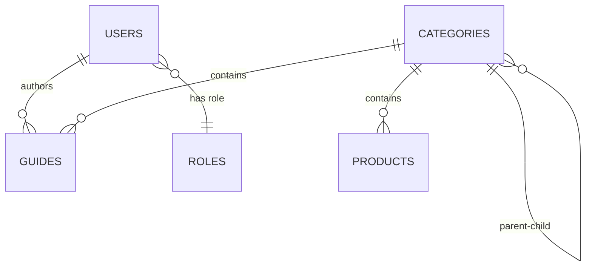

# Database Schema Documentation

Generated: 2025-12-27

## Overview

The database contains 5 main tables for the Bargainly application:

| Table | Rows | Purpose |
|-------|------|---------|
| **categories** | 0 | Product/guide categories |
| **guides** | 0 | Shopping guides and reviews |
| **products** | 0 | Product catalog |
| **roles** | 3 | User role definitions |
| **users** | 3 | User accounts |

---

## Table Schemas

### 1. ROLES

**Purpose**: Define user roles and their permissions

**Columns:**
- `id` (UUID) - Primary key
- `name` (string) - Role name (ADMIN, EDITOR, VIEWER, MARKETING)
- `description` (string) - Role description
- `permissions` (JSON array) - List of permission strings
- `created_at` (timestamp) - Creation timestamp
- `updated_at` (timestamp) - Last update timestamp

**Sample Data:**
```json
{
  "id": "9df71dc1-ffda-4cf3-a2f3-71b656d116e3",
  "name": "ADMIN",
  "description": "Full system access with all permissions",
  "permissions": [
    "users:read", "users:write", "users:delete",
    "reviews:read", "reviews:write", "reviews:delete",
    "categories:read", "categories:write", "categories:delete",
    "products:read", "products:write", "products:delete",
    "settings:read", "settings:write"
  ],
  "created_at": "2025-12-25T19:20:56.665942+00:00",
  "updated_at": "2025-12-25T19:20:56.665942+00:00"
}
```

**Existing Roles:**
- ADMIN (3 permissions)
- EDITOR
- MARKETING

---

### 2. USERS

**Purpose**: Store user account information

**Columns:**
- `id` (UUID) - Primary key
- `email` (string) - User email (unique)
- `name` (string) - User display name
- `image` (string, nullable) - Profile image URL
- `role` (string) - User role (references roles.name)
- `created_at` (timestamp) - Account creation timestamp
- `last_login_at` (timestamp, nullable) - Last login timestamp
- `is_enabled` (boolean) - Whether account is active

**Sample Data:**
```json
{
  "id": "adf366a9-4b8b-41e0-aedf-60eafb027b53",
  "email": "marketing@bargainly.net",
  "name": "Marketing Admin",
  "image": null,
  "role": "MARKETING",
  "created_at": "2025-12-25T19:29:15.886+00:00",
  "last_login_at": null,
  "is_enabled": true
}
```

**Existing Users:**
- 3 users total
- Roles: MARKETING, ADMIN, etc.

---

### 3. CATEGORIES

**Purpose**: Organize products and guides into categories

**Status**: Empty (0 rows)

**Expected Schema** (based on typical e-commerce structure):
- `id` - Primary key
- `name` - Category name
- `slug` - URL-friendly identifier
- `description` - Category description
- `parent_id` - For hierarchical categories (nullable)
- `created_at` - Creation timestamp
- `updated_at` - Last update timestamp

---

### 4. GUIDES

**Purpose**: Store shopping guides and product reviews

**Status**: Empty (0 rows)

**Expected Schema** (based on review/guide system):
- `id` - Primary key
- `title` - Guide title
- `slug` - URL-friendly identifier
- `content` - Guide content (rich text/markdown)
- `author_id` - References users.id
- `category_id` - References categories.id
- `status` - Publication status (draft, published, archived)
- `featured_image` - Image URL
- `meta_title` - SEO title
- `meta_description` - SEO description
- `created_at` - Creation timestamp
- `updated_at` - Last update timestamp
- `published_at` - Publication timestamp

---

### 5. PRODUCTS

**Purpose**: Store product catalog information

**Status**: Empty (0 rows)

**Expected Schema** (based on e-commerce structure):
- `id` - Primary key
- `name` - Product name
- `slug` - URL-friendly identifier
- `description` - Product description
- `price` - Product price
- `sale_price` - Discounted price (nullable)
- `category_id` - References categories.id
- `image_url` - Product image
- `stock` - Available quantity
- `sku` - Stock keeping unit
- `is_active` - Whether product is available
- `created_at` - Creation timestamp
- `updated_at` - Last update timestamp

---

## Relationships



---

## Permission System

Permissions are stored as JSON arrays in the `roles` table. Format: `"resource:action"`

**Resources:**
- users
- reviews (guides)
- categories
- products
- settings
- analytics
- campaigns

**Actions:**
- read
- write
- delete

**Example Permissions:**
- `users:read` - Can view users
- `products:write` - Can create/update products
- `reviews:delete` - Can delete reviews

---

## Next Steps

1. **Generate TypeScript Interfaces** - Create type-safe interfaces for all tables
2. **Create Repository Layer** - Build data access layer for each table
3. **Create Service Layer** - Build business logic services
4. **Create API Routes** - Build versioned API endpoints (`/api/v1/...`)

---

## Running Schema Inspection

To regenerate this documentation:

```bash
npm run inspect:schema
```

This will output the current schema of all tables to the console.
